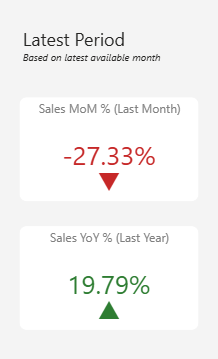
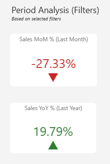

# Executive_Sales_Profitability_Dashboard_Power_BI
# Executive Sales & Profitability Dashboard | Power BI

## Descripción del Proyecto
Este proyecto presenta un **Dashboard Ejecutivo de Ventas y Rentabilidad** desarrollado en **Power BI**, cuyo objetivo es ofrecer una visión clara y estratégica del desempeño comercial y financiero a lo largo del tiempo.

El dashboard está pensado para **usuarios de negocio y tomadores de decisiones**, combinando indicadores clave con la posibilidad de profundizar el análisis mediante filtros interactivos.

---

## Objetivos
- Analizar **Ventas Totales, Utilidad Total y Margen de Utilidad**
- Evaluar el desempeño **Mes contra Mes (MoM)** y **Año contra Año (YoY)**
- Identificar tendencias de ventas en el tiempo
- Comparar ventas y rentabilidad por **categoría y subcategoría**
- Presentar la información de forma clara, ejecutiva y visualmente consistente

---

## Funcionalidades Principales
- **Tarjetas KPI**:
  - Ventas Totales
  - Utilidad Total
  - Margen de Utilidad (%)
  

- **Indicadores de Desempeño**:
  - Variación MoM y YoY
  - Flechas direccionales (▲▼)
  - Formato condicional por color:
    - Verde: resultado positivo
    - Rojo: resultado negativo
    - Gris: sin variación

          
    
- **Análisis Temporal**:
  - Tendencia de ventas a lo largo del tiempo
- **Análisis por Categoría**:
  - Ventas por categoría con participación porcentual
- **Filtros Interactivos**:
  - Año
  - Mes
  - Producto
  - Categoría / Subcategoría
  - Estado
  - Región

---

## Herramientas y Tecnologías
- **Power BI Desktop**
- **DAX** para cálculos y medidas de KPIS e indicadores
- **Modelado de datos** (enfoque tipo estrella)
- **Power Query** para limpieza y transformación de datos
- **SQL(PosgreSQL) Creación de tablas para modelado de datos tipo estrella a partir de un dataset extraido de la página Kaglee
---

## Consideraciones de Diseño
- Diseño orientado a dashboards ejecutivos
- Paleta de colores sobria y consistente
- Uso de iconos e indicadores visuales para facilitar la lectura
- Enfoque en claridad y reducción de ruido visual

---

## Conceptos DAX Aplicados
- Inteligencia de tiempo (MoM, YoY)
- Manejo de contexto de filtros
- Medidas dinámicas
- Formato condicional basado en resultados
- Control de escenarios positivos, negativos y neutros

---

## Vista Previa del Dashboard

## KPIs

     

## Medidas Construidas con DAX

## Total Sales = 
   SUM(fact_sales[sales])
## Total Profit = 
   SUM(fact_sales[profit])
   
## MoM % Global (Indicador) = 
CALCULATE(
    [Sales MoM % (Indicador)],
    REMOVEFILTERS(dim_date)
)
## YoY %  Global (Indicador) = 
CALCULATE(
    [Sales YoY % (Indicador)],
    REMOVEFILTERS(dim_date)
)

## Sales MoM % (KPI) = 
DIVIDE(
    [Sales Current Month (KPI)] - [Sales Previous Month (KPI)],
    [Sales Previous Month (KPI)]
)

## Sales YoY % (KPI) = 
DIVIDE(
    [Sales Current Year (KPI)] - [Sales Previous Year (KPI)],
    [Sales Previous Year (KPI)]
)

## Sales Current Year (KPI) = 
VAR _MaxDate = [Date Max]
VAR _StartYear =
    DATE(YEAR(_MaxDate),1, 1)
RETURN
CALCULATE(
    [Total Sales],
    dim_date[date] >= _StartYear,
    dim_date[date] <= _MaxDate
)

## Sales Current Month (KPI) = 
VAR _MaxDate = [Date Max]
VAR _StartMonth =
   DATE(YEAR(_MaxDate), MONTH(_MaxDate), 1)
RETURN
CALCULATE(
    [Total Sales],
    dim_date[date] >= _StartMonth,
    dim_date[date] <= _MaxDate
)

## Sales Previous Month (KPI) = 
VAR _MaxDate = [Date Max]
VAR _StartPrevMonth =
    DATE(YEAR(_MaxDate ), MONTH(_MaxDate ) - 1, 1)
VAR _EndPrevMonth =
    EOMONTH(_MaxDate , -1)
RETURN
CALCULATE(
    [Total Sales],
    dim_date[date] >= _StartPrevMonth,
    dim_date[date] <= _EndPrevMonth
)

## Sales Previous Year (KPI) = 
VAR _MaxDate = [Date Max]
VAR _PrevYear =
    YEAR(_MaxDate) - 1
VAR _StartPrevYear =
    DATE(_PrevYear, 1, 1)
VAR _EndPrevYear =
    DATE(_PrevYear, 12, 31)
RETURN
CALCULATE(
    [Total Sales],
    dim_date[date] >= _StartPrevYear,
    dim_date[date] <= _EndPrevYear
)

---

## Notas
Este proyecto forma parte de mi **portafolio de Business Intelligence y Análisis de Datos**, y tiene como objetivo demostrar habilidades tanto analíticas como de diseño de dashboards.

---

## 👤 Autor
**Whendy Ocampo**  
Business Intelligence & Data Analytics  
